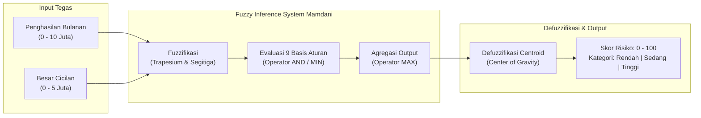

# Sistem Penilaian Risiko Peminjaman Menggunakan Logika Fuzzy Metode Mamdani

**Mata Kuliah:** Kecerdasan Buatan (_Artificial Intelligence_)  
**Topik:** Sistem Inferensi Fuzzy (_Fuzzy Inference System - FIS_)  
**Metode:** Mamdani (Max-Min) & Defuzzifikasi _Centroid / Center of Gravity (CoG)_

---

## 📌 Ringkasan Proyek

Proyek ini merancang dan membangun sistem pendukung keputusan cerdas untuk menilai tingkat risiko peminjaman kredit (_credit risk scoring_) pada institusi keuangan (_Fintech_ / Perbankan). Sistem ini memetakan dua parameter utama peminjam, yaitu **Penghasilan Bulanan** dan **Besar Cicilan**, untuk menghasilkan **Skor Indeks Risiko** ($0 - 100$) beserta kategori kelayakannya (**Rendah / Disetujui**, **Sedang / Ditinjau Ulang**, **Tinggi / Ditolak**).

---

## 🏛️ Struktur Dokumen Perancangan

Dokumentasi dan perencanaan lengkap proyek ini telah disusun secara terstruktur di dalam folder `docs/`:

```
Kecerdasan Buatan/
│
├── README.md                                    <- Informasi umum dan ringkasan proyek
│
└── docs/
    ├── PROPOSAL_SISTEM_FUZZY_MAMDANI.md         <- Dokumen Lengkap (Bab I s.d. Bab IV + Daftar Pustaka)
    ├── SPESIFIKASI_MATEMATIS_DAN_ATURAN.md     <- Lembar teknis fungsi keanggotaan & 9 aturan fuzzy
    └── SKENARIO_PENGUJIAN.md                    <- 10 Skenario uji simulasi & analisis sensitivitas
```

---

## ⚙️ Spesifikasi Arsitektur Sistem Fuzzy



---

## 📊 Ringkasan Variabel & Himpunan Fuzzy

| Variabel          |  Tipe   | Semesta Pembicaraan |             Himpunan Fuzzy             |             Tipe Kurva             |                           Parameter                           |
| :---------------- | :-----: | :-----------------: | :------------------------------------: | :--------------------------------: | :-----------------------------------------------------------: |
| **Penghasilan**   | Input 1 | $0 - 10$ Juta/Bulan | **Rendah**<br>**Sedang**<br>**Tinggi** | Trapesium<br>Segitiga<br>Trapesium |       $[0, 0, 2, 5]$<br>$[2, 5, 8]$<br>$[5, 8, 10, 10]$       |
| **Cicilan**       | Input 2 | $0 - 5$ Juta/Bulan  | **Ringan**<br>**Sedang**<br>**Berat**  | Trapesium<br>Segitiga<br>Trapesium | $[0, 0, 0.5, 1.5]$<br>$[0.5, 1.5, 2.5]$<br>$[1.5, 2.5, 5, 5]$ |
| **Risiko Kredit** | Output  | $0 - 100$ (Indeks)  | **Rendah**<br>**Sedang**<br>**Tinggi** | Trapesium<br>Segitiga<br>Trapesium |  $[0, 0, 20, 40]$<br>$[30, 50, 70]$<br>$[60, 80, 100, 100]$   |

---

## 📑 Matriks 9 Basis Aturan (_Fuzzy Rule Base_)

| Penghasilan \ Cicilan    | Ringan ($0 - 1.5$ Jt) | Sedang ($0.5 - 2.5$ Jt) | Berat ($1.5 - 5.0$ Jt) |
| :----------------------- | :-------------------: | :---------------------: | :--------------------: |
| **Rendah ($0 - 5$ Jt)**  |    [R1] **Sedang**    |     [R2] **Tinggi**     |    [R3] **Tinggi**     |
| **Sedang ($2 - 8$ Jt)**  |    [R4] **Rendah**    |     [R5] **Sedang**     |    [R6] **Tinggi**     |
| **Tinggi ($5 - 10$ Jt)** |    [R7] **Rendah**    |     [R8] **Rendah**     |    [R9] **Sedang**     |

---

## 🧮 Contoh Verifikasi Hitung Manual (Kasus Bab III)

- **Data Masukan:** Penghasilan = **Rp 3.000.000,-**, Cicilan = **Rp 2.000.000,-**
- **Hasil Fuzzifikasi:**
  - Penghasilan: $\mu_{\text{Rendah}}(3) = 0.67$, $\mu_{\text{Sedang}}(3) = 0.33$, $\mu_{\text{Tinggi}}(3) = 0$
  - Cicilan: $\mu_{\text{Ringan}}(2) = 0$, $\mu_{\text{Sedang}}(2) = 0.50$, $\mu_{\text{Berat}}(2) = 0.50$
- **Aturan Aktif & Derajat Implikasi ($\alpha$):**
  - $R_2$ (Rendah & Sedang): $\min(0.67, 0.50) = 0.50 \rightarrow \text{Risiko Tinggi}$
  - $R_3$ (Rendah & Berat): $\min(0.67, 0.50) = 0.50 \rightarrow \text{Risiko Tinggi}$
  - $R_5$ (Sedang & Sedang): $\min(0.33, 0.50) = 0.33 \rightarrow \text{Risiko Sedang}$
  - $R_6$ (Sedang & Berat): $\min(0.33, 0.50) = 0.33 \rightarrow \text{Risiko Tinggi}$
- **Agregasi Output:**
  - $\mu_{\text{Tinggi}}^{\text{agg}} = 0.50$, $\mu_{\text{Sedang}}^{\text{agg}} = 0.33$, $\mu_{\text{Rendah}}^{\text{agg}} = 0$
- **Defuzzifikasi Centroid ($z^*$):**
  - Skor Risiko: $\approx \mathbf{70.0}$ (Kategori: **Risiko Tinggi / Pinjaman Ditolak**)

---

## 🚀 Rencana Pengembangan Lanjutan

1. **Implementasi Komputasi:** Pembuatan script Python untuk komputasi inferensi Mamdani.
2. **Visualisasi:** Visualisasi grafik kurva fungsi keanggotaan dan pemodelan permukaan keputusan 3D (_Control Surface_).
3. **Ekspor Laporan:** Format dokumen laporan siap cetak (PDF / Word).
